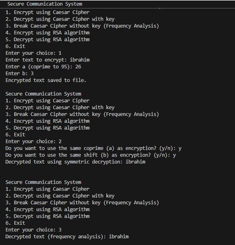
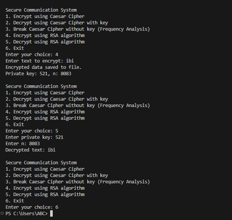

# 🔐 Secure Communication Tool (C++)

A C++ console-based encryption tool featuring Caesar Cipher encryption/decryption, frequency analysis-based decryption, and RSA encryption. Includes complete file I/O, user menu, and modular cryptographic methods.

---

## 🧠 Features

- 🧪 **Caesar Cipher (Affine variant)**  
  - Supports custom coprime (a) and shift (b)
  - Saves encrypted and decrypted files

- 🔎 **Frequency Analysis Decryption**  
  - Break Caesar Cipher without key using English letter frequency

- 🔐 **RSA Encryption**  
  - Random prime-based key generation
  - Saves and reads encrypted output to/from files

- 🧾 **File Persistence**  
  - Automatically reads from and writes to `.txt` files

- 🖥️ **Modular CLI App**  
  - Built-in menu and user input prompts
  - Clean and annotated C++ code

---

## 💻 Technologies Used

- **Language:** C++  
- **Platform:** Windows (tested)  
- **Libraries:** iostream, fstream, cmath, vector, map, ctime  

---

## 📂 File Structure

| Folder       | Contents                                   |
|--------------|--------------------------------------------|
| `code/`      | Contains the complete C++ source code      |
| `data/`      | Generated files for Caesar & RSA encryption|
| `images/`    | Screenshots of CLI demo                    |

---

## 🔧 How to Use

1. Compile the file with any C++ compiler:
   g++ secure_communication.cpp -o secure_comm
2. Run the program:
   ./secure_comm
3. Choose an option from the menu and follow the prompts.

---

## 📸 Demo

---

## 👤 Author

- [Aleeza Rizwan](https://github.com/its-aleezA)  

---

## 🔖 License

This project is licensed under the MIT License.
See the [LICENSE](LICENSE) file for full details.
